##### 基于TDBCache编写一个查询接口

以提供基金经理信息(getManagerInfo)为例。通过基金经理代码查询信息。

1.1  /trunk/build/Proto/FrontMiddleProto/FundDataCenterComm.tars下编写基金经理表对应信息。

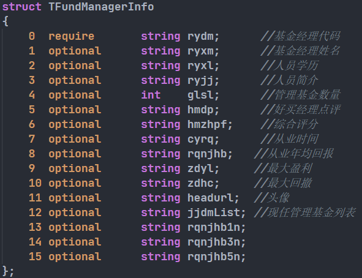

1.2  trunk/ProductMiddlePlatform/FundDataCenterBaseSvr/FundDataCenterBaseSvr.conf下编写基金经理的配置信息。

 	表信息先写入到缓存Cache中，数据根据指定的基金经理代码为key，表记录为value形成一个map存储在缓存中。目前查询是需要用到缓存的，方便查询，提高效率。如果需要指定一些字段条件以及需要联表等操作的话，就可以不考虑缓存，直接SQL语句查询即可。

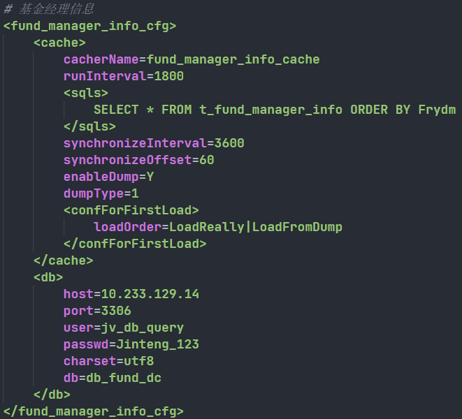

1.3 trunk/ProductMiddlePlatform/FundDataCenterBaseSvr/FundDataCenterBaseServant.tars下编写入参、出参以及接口函数

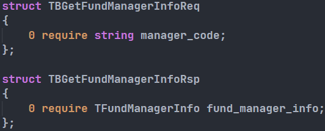

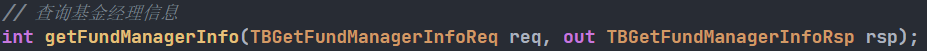

1.4  trunk/ProductMiddlePlatform/FundDataCenterBaseSvr/Cache/FundManagerInfoCache.h和FundManagerInfoCache.cpp的编写

​	主要用于获取缓存信息。通过主键作为key，从缓存中查询value并封装成TFundManagerInfo。

1.4.1 .h文件编写

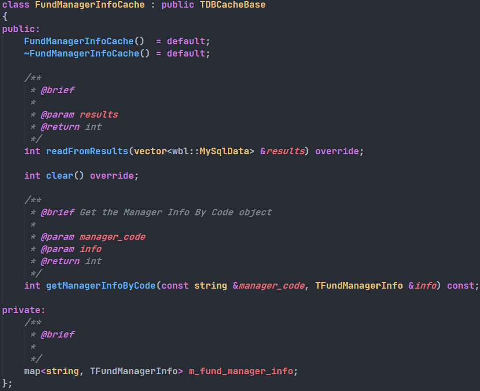

1.4.2 .cpp文件编写

​	主要对.h文件定义的函数进行实现。

​	clear()函数主要用于清除内容。

​	readFromResults()主要对缓存中的数据做map映射，然后将数据转为对于的TFundManagerInfo结构体。

​	getManagerInfoByCode主要通过主键从map中查询该主键是否有值，然后将结果封装到出参rsp上。

1.5 trunk/ProductMiddlePlatform/FundDataCenterBaseSvr/FundDataCenterBaseSvr.h和FundDataCenterBaseSvr.cpp下添加基金经理的相关信息，对基金经理相关缓存进行初始化。

1.5.1 .h文件

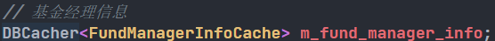

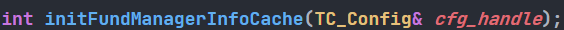

1.5.2 .cpp文件

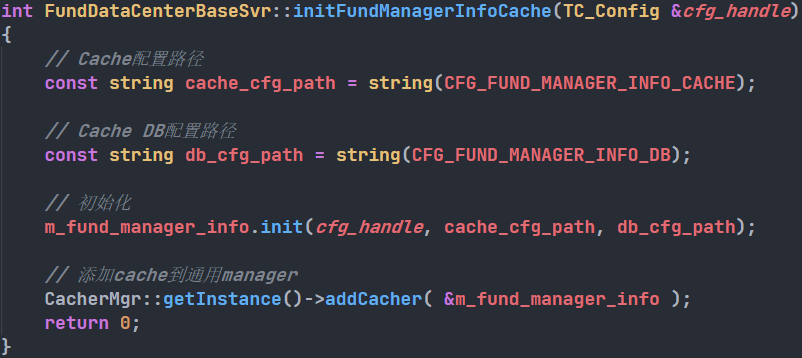

1.6 trunk/ProductMiddlePlatform/FundDataCenterBaseSvr/FundDataCenterBaseServantImp.h和FundDataCenterBaseServantImp.cpp对tars文件定义的接口函数进行实现

1.6.1 .h文件

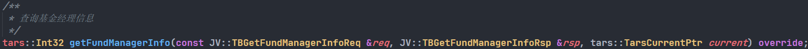

1.6.2 .cpp文件

​	主要是调用getFundManagerInfoByCode实现。

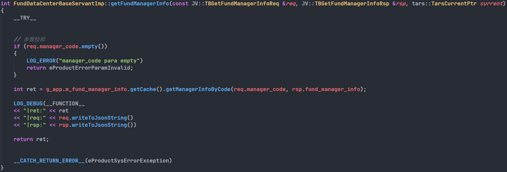

1.7 编译

​	如果有错误，修改后重新编译即可。

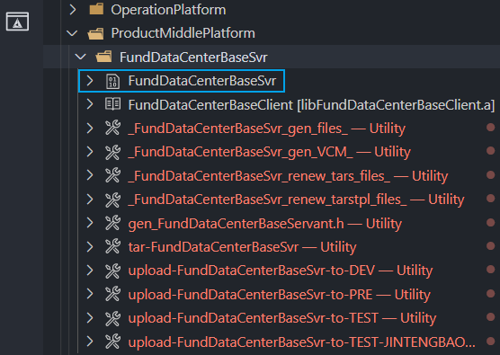

1.8 登录开发环境

1.8.1 将tars添加

​	tars文件内容需要包含上述过程中两个tars文件的内容。如果显示系统内部错误，说明tars文件出错，检查是否有少分号等错误。

1.8.2 将conf配置文件内容修改

​	直接将conf文件内容复制粘贴上去即可。

1.8.3 重启服务

​	如果启动失败，可以查看日志内容。

1.8.4 进行接口调试

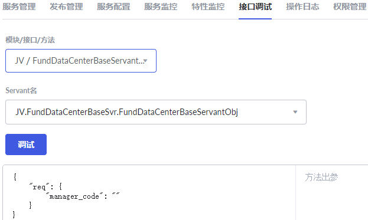

